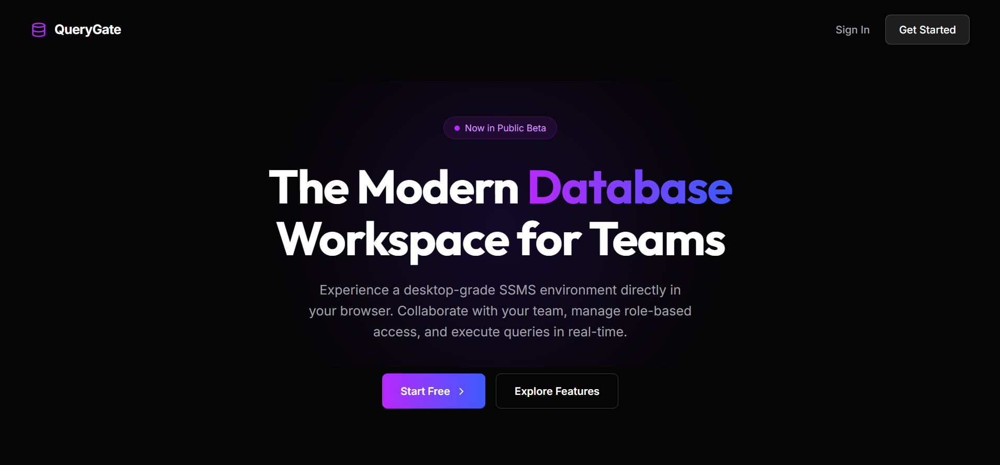

<div align="center">
  
  
  <h1>🚀 QueryGate</h1>
  <p><strong>A Modern, Web-Based Database Management Studio & SQL Editor</strong></p>

  <p>
    
    
    
    
    
  </p>
</div>

<br />

## 📖 Overview
QueryGate is a full-stack, cloud-ready Database Management Studio built for the modern web. It provides developers with a seamless, high-performance interface to connect to databases, visualize schemas, and execute SQL queries without ever leaving the browser. 

Designed with a premium glassmorphism UI, QueryGate combines the power of enterprise database tools with the aesthetics and speed of a modern single-page application.

## ✨ Features
- **💻 VS-Code-like SQL Editor:** Powered by the Monaco Editor, featuring syntax highlighting, auto-completion, and multi-tab support.
- **🔐 Secure Authentication:** Seamless Google OAuth 2.0 integration and stateless JWT authentication with BCrypt hashing and brute-force protection.
- **📊 ER Diagram Visualization:** Automatically reverse-engineers database schemas to generate interactive Entity-Relationship diagrams.
- **📱 Responsive Glassmorphism UI:** A stunning, mobile-first design with built-in Dark/Light mode toggling.
- **👥 Team Collaboration:** Built-in team panel for managing workspaces and collaborating with multiple developers.
- **☁️ Cloud-Ready Architecture:** Designed to be easily containerized and deployed across AWS infrastructure (EC2, RDS, Amplify).

## 🛠️ Tech Stack
- **Frontend**: React.js 18, Vite, React Router, React-Helmet-Async, Monaco Editor, Lucide Icons.
- **Backend**: Java 17, Spring Boot, Spring Data JPA, Spring Security, JSON Web Tokens (jjwt), Google API Client.
- **Database**: MySQL.

## 🚀 Getting Started (Local Development)

### Prerequisites
- Node.js (v18+)
- Java JDK 17
- Maven
- MySQL Server

### 1. Clone the repository
```bash
git clone https://github.com/GarvXlearner/QueryGate.git
cd QueryGate
```

### 2. Start the Backend (Spring Boot)
Ensure your local MySQL server is running, then configure `application.properties` with your database credentials.
```bash
cd Backend
./mvnw spring-boot:run
```
*The backend will start on `http://localhost:8080`*

### 3. Start the Frontend (React + Vite)
Open a new terminal window:
```bash
cd Frontend
npm install
npm run dev
```
*The frontend will start on `http://localhost:5173`*

## 🛡️ Security Highlights
- **Stateless JWTs:** Secure token validation through custom Spring Security filters.
- **Account Lockouts:** Mitigates brute-force attacks by locking accounts after 3 failed password attempts.
- **OAuth Verification:** Cryptographic backend validation of Google ID tokens ensures completely secure third-party sign-ins.

## 🤝 Contributing
Contributions, issues, and feature requests are welcome! Feel free to check the [issues page](https://github.com/GarvXlearner/QueryGate/issues).

---
<div align="center">
  <p>Built with ❤️ by Garv</p>
</div>
